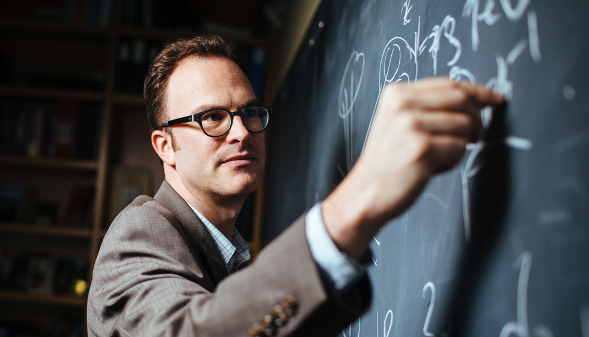

## Biography

Jesse Thaler is a theoretical particle physicist who fuses techniques from quantum field theory and machine learning to address outstanding questions in fundamental physics. His current research is focused on maximizing the discovery potential of the Large Hadron Collider through new theoretical frameworks and novel data analysis techniques. Prof. Thaler joined the MIT Physics Department in 2010, and is currently a Professor in the Center for Theoretical Physics. In 2020, Prof. Thaler became the inaugural Director of the NSF Institute for Artificial Intelligence and Fundamental Interactions.

*For a longer biography, see my [MIT Physics faculty profile](https://physics.mit.edu/faculty/jesse-thaler/).*

### Selected Awards


  
  * **{{award.name}}**, *{{award.org}}*, *{{award.date}}*
  


### Selected Publications


  
  * **[{{paper.title}}](https://doi.org/{{paper.doi}})**, *{{paper.authors}} ({{paper.year}})* 
  


### Photographs

  * {:.image--sm}
    **[Head Shot](images/jthaler_photo_2017.jpg)**
    
  * {:.image--sm}
    **[Blackboard Shot](images/jthaler_mit_spotlight.jpg)**

## In the News

### Profiles and Highlights

  * [DOE on Early Career](https://www.energy.gov/science/articles/jesse-thaler-then-and-now-2011-early-career-award-winner)
  * [ACM on IAIFI](https://cacm.acm.org/news/253847-using-ai-to-drill-down-in-physics/)
  * [New York Times on IAIFI](https://www.nytimes.com/2020/11/23/science/artificial-intelligence-ai-physics-theory.html)
  * [IAIFI Launch](https://news.mit.edu/2020/nsf-announces-mit-led-institute-artificial-intelligence-fundamental-interactions-0826)
    ([NSF](https://www.nsf.gov/news/special_reports/announcements/082620.jsp), [Harvard](https://www.news.harvard.edu/gazette/story/2020/08/harvard-a-partner-in-20-million-ai-institute/))
  * [Energy Mover's Distance](http://news.mit.edu/2019/new-physics-anomalous-particles-0726)
    ([Collider Blog](https://muon.wordpress.com/2019/02/24/miracles-when-you-use-the-right-metric/), [Ars Technica](https://arstechnica.com/science/2019/07/mit-physicists-social-networks-could-hold-the-key-to-finding-new-particles/), [Phys.org](https://phys.org/news/2019-08-metric-capture-similarity-collider-events.html))
  * [CTP@50](http://news.mit.edu/2018/mit-center-theoretical-physics-marks-50th-anniversary-symposium-looking-present-and-future-0328)
  * [2017 Faculty Profile](http://news.mit.edu/2017/faculty-profile-jesse-thaler-1107) ([MIT Front Page](http://spotlight.mit.edu/2017/chalkboard-theorist))
  * [CMS Open Data](http://news.mit.edu/2017/first-open-access-data-large-collider-subatomic-particle-patterns-0929)
  * [ABRACADABRA](http://news.mit.edu/2016/team-simulates-magnetar-seek-dark-matter-particle-1007)
  * [Miller Fellow Focus Article](http://www.jthaler.net/downloads/jthaler_MillerNewsletter.pdf)

### Awards and Honors

  * [APS Fellowship](https://news.mit.edu/2022/american-physical-society-fellows-1019)
  * [Simons Investigator](https://news.mit.edu/2022/three-mit-faculty-members-named-2022-simons-investigators-0624)
  * [QuantISED](http://news.mit.edu/2018/mit-center-theoretical-physics-professors-quantum-information-science-awards-1012)
  * [Promotion](http://news.mit.edu/2017/seven-mit-science-professors-granted-tenure-0628)
  * [Edgerton Award](http://news.mit.edu/2016/ribbeck-thale-edgerton-award-0420)
  * [Sloan Award](http://newsoffice.mit.edu/2013/six-mit-researchers-win-sloan-research-fellowships)
  * [PECASE Award](http://newsoffice.mit.edu/2012/pecase-winners-announced-0723)
  * [DOE Early Career Award](http://science.mit.edu/news/five-mit-receive-doe-early-career-research-grants)

### Quotations and Perspectives

  * [New Scientist on Symbolic Regression](https://www.newscientist.com/article/mg25634141-200-will-artificial-intelligence-ever-discover-new-laws-of-physics/)
  * [IEEE Spectrum on Machine Learning](https://spectrum.ieee.org/machine-learning-in-physics)
  * [Quanta Magazine on Axion Dark Matter](https://www.quantamagazine.org/a-hint-of-dark-matter-sends-physicists-looking-to-the-skies-20211019/)
  * [Facebook AI on Deep Networks](https://ai.facebook.com/blog/advancing-ai-theory-with-a-first-principles-understanding-of-deep-neural-networks/)
  * [The Tech on Flexible P/NR](https://thetech.com/2020/03/25/faculty-discuss-flexible-pnr)
  * [CERN on Fifth Forces](https://phys.org/news/2019-11-plot-thickens-hypothetical-x17-particle.html)
  * [Symmetry Magazine on Open Data](http://symmetrymagazine.org/article/with-open-data-scientists-share-their-work)
  * [CMS Open Data ML Release](https://cms.cern/news/cms-releases-open-data-machine-learning)
  * [Fermilab on Ml4Jets](https://news.fnal.gov/2018/11/scientists-meet-at-fermilab-to-discuss-machine-learning-for-jet-physics/)
  * [PNAS on Dark Matter](http://www.pnas.org/content/114/44/11557.full.pdf)
  * [Scientific American on Dark Matter](https://www.scientificamerican.com/article/in-the-dark-about-dark-matter/)
  * [Nature on Fifth Forces](https://www.nature.com/news/has-a-hungarian-physics-lab-found-a-fifth-force-of-nature-1.19957)
  * [Bloomberg on After Higgs](http://www.bloomberg.com/news/articles/2015-04-02/after-higgs-boson-what-physicists-are-looking-for-now)
  * [Wired Magazine on Higgs](http://www.wired.com/2015/01/higgs-discovery-hijack-attempt/)
  * [Seacoast Online on Particle Fever](http://www.seacoastonline.com/article/20140514/NEWS/405140373)
  * [Symmetry Magazine on Dark Matter](http://www.symmetrymagazine.org/article/november-2013/connecting-the-visible-universe-with-dark-matter)
  * [2012 Medford High School Visit](http://www.mhsmustangnews.com/2012/10/29/academic-news-mits-jesse-thaler-visits-mhs/)

### Students in the News

  * [Radha Mastandrea](http://news.mit.edu/2018/Radha-Mastandrea-student-1018)  ([Heising-Simons Fellowship](http://news.mit.edu/2018/paying-it-forward-fellowship-boosts-women-physics-0802))
  * [Kevin Zhou](http://news.mit.edu/2017/student-profile-kevin-zhou-0421)  ([Marshall Scholarship](http://news.mit.edu/2016/four-mit-students-marshall-scholars-1128))

<!--
## Research Interests

The dots above indicate publications on my [[cv]].  My research interests span a [[research details|wide range of topics]] in and beyond the standard model:

  * Collider Physics and Quantum Chromodynamics
    * [[research details#Jets and Jet Substructure|Jets and Jet Substructure]]
    * [[research details#Open Data Studies|Open Data Studies]]
  * Theoretical Frameworks Beyond the Standard Model
    * [[research details#Novel Dark Matter Dynamics|Novel Dark Matter Dynamics]]
    * [[research details#Supersymmetry and Supersymmetry Breaking|Supersymmetry and Supersymmetry Breaking]]

### Selected Publications

  * **Dark Photons from Charm Mesons at LHCb**. \\ Philip Ilten, Jesse Thaler, Mike Williams, and Wei Xue. \\ [[http://dx.doi.org/10.1103/PhysRevD.92.115017|Phys. Rev. D92:115017 (2015)]], [[http://arxiv.org/abs/1509.06765|arXiv:1509.06765]].

  * **The Goldstone and Goldstino of Supersymmetric Inflation**. \\ Yonatan Kahn, Daniel A. Roberts, and Jesse Thaler. \\ [[http://dx.doi.org/10.1007/JHEP10(2015)001|JHEP 1510:001 (2015)]], [[http://arxiv.org/abs/1504.05958|arXiv:1504.05958]].

  * **Sudakov Safety in Perturbative QCD**. \\ Andrew J. Larkoski, Simone Marzani, and Jesse Thaler. \\ [[http://dx.doi.org/10.1103/PhysRevD.91.111501|Phys. Rev. D91:111501 (2015)]], [[http://arxiv.org/abs/1502.01719|arXiv:1502.01719]].

  *  **(In)direct Detection of Boosted Dark Matter**. \\ Kaustubh Agashe, Yanou Cui, Lina Necib, and Jesse Thaler.  \\ [[http://dx.doi.org/10.1088/1475-7516/2014/10/062|JCAP 1410:062 (2014)]], [[http://arxiv.org/abs/1405.7370|arXiv:1405.7370]].

  * **Soft Drop**. \\ Andrew J. Larkoski, Simone Marzani, Gregory Soyez, and Jesse Thaler.\\ [[http://dx.doi.org/10.1007/JHEP05(2014)146|JHEP 1405:146 (2014)]], [[http://arxiv.org/abs/1402.2657|arXiv:1402.2657]].

  * **Anomaly Mediation from Unbroken Supergravity**. \\ Francesco D'Eramo, Jesse Thaler, and Zachary Thomas. \\ [[http://dx.doi.org/10.1007/JHEP09(2013)125|JHEP 1309:125 (2013)]], [[http://arxiv.org/abs/1307.3251|arXiv:1307.3251]].

  * **Flavor Mediation Delivers Natural SUSY**. \\ Nathaniel Craig, Matthew McCullough, and Jesse Thaler. \\ [[http://dx.doi.org/10.1007/JHEP06(2012)046|JHEP 1206:046 (2012)]], [[http://www.arxiv.org/abs/1203.1622|arXiv:1203.1622]].

  * **Identifying Boosted Objects with N-subjettiness**.\\ Jesse Thaler and Ken Van Tilburg.\\ [[http://dx.doi.org/10.1007/JHEP03(2011)015|JHEP 1103:015 (2011)]], [[http://www.arxiv.org/abs/1011.2268|arXiv:1011.2268]].

  * **Semi-annihilation of Dark Matter**.\\ Francesco D'Eramo and Jesse Thaler.\\ [[http://dx.doi.org/10.1007/JHEP06(2010)109|JHEP 1006:109 (2010)]], [[http://www.arxiv.org/abs/1003.5912|arXiv:1003.5912]].

  * **Goldstini**.\\ Clifford Cheung, Yasunori Nomura, and Jesse Thaler.\\  [[http://dx.doi.org/10.1007/JHEP03(2010)073|JHEP 1003:073 (2010)]], [[http://www.arxiv.org/abs/1002.1967|arXiv:1002.1967]].

  * **Jet Trimming**.\\ David Krohn, Jesse Thaler, and Lian-Tao Wang.\\ [[http://dx.doi.org/10.1007/JHEP02(2010)084|JHEP 1002:084 (2010)]], [[http://www.arxiv.org/abs/0912.1342|arXiv:0912.1342]].

  * **Dark Matter through the Axion Portal**.\\ Yasunori Nomura and Jesse Thaler.\\ [[http://link.aps.org/abstract/PRD/v79/e075008|Phys. Rev. D79:075008 (2009)]], [[http://www.arxiv.org/abs/0810.5397|arXiv:0810.5397]].
-->
