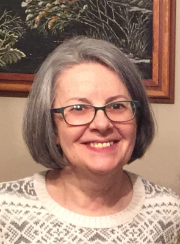

**November 23, 1956 - July 6, 2018**

{:.rounded.image--xl}

## Service

  * [Program](ania/ania_program.pdf) (September 29, 2018)

### Readings

  * [Eulogy](ania/ania_eulogy.pdf) (Sasha Thaler)
  * [Wherever You Go](ania/ania_norbet.pdf) (Gregory Norbet, read by Jesse Thaler)
  * [Reflections on a Remarkable Woman](ania/ania_reflections.pdf) (Andrew Lowe & Elise Adib-Samii Riegel)
  * [Remembrances / Sé Que Estás Aquí](ania/ania_nahmens.pdf) (Gis-Xi Nahmens / Anónimo)
  
### Music

  * Processional:  The Choir of the Cathedral of the Saint Alexander Nevsky Church of Paris
  * Malagueña (Ernesto Lecuona, performed by Jodie DeSalvo)
  * Saint Louis Blues (W.C. Handy, performed by Thomas Gotwals)
  * [There is a Balm in Gilead](https://www.youtube.com/watch?v=okl2XbTM7xM) (Paul Robeson)

### Burial

  * [From a Fellow Marksman](ania/ania_gotwals.pdf) (Molly Gotwals)
  * [For a Close and Dear Friend](ania/ania_vasilenko.pdf) (Yelena Vasilenko)
  * [Death is Nothing At All](ania/ania_vianney.pdf) (Henry Scott Holland, read by Brett Vianney)
  
## Obituary

Anna B. McCarthy, 61, of Suffield, originally of St. Petersburg (Leningrad), Russia, passed away on July 6, 2018. 

Before coming to Suffield, Anna studied and worked in Leningrad, Russia, and La Isla de Pinos, Cuba. Anna received her bachelor’s and master’s degrees in English and American Literature from Leningrad State University. In Cuba, Anna earned a certificate in Spanish language and literature from the Institute of Advanced Pedagogical Studies, taught 9th and 10th-grade English in a local boarding school and oversaw a postgraduate program for high school teachers of Russian. After returning to Russia, Anna completed postgraduate studies in tourism and interpreting, taught K-12 English, worked as an interpreter and translator for various tourist companies, and gave English and Spanish classes to adults working in the field of international business and to prospective emigrants. 

Anna came to the U.S. in 1989, and the following year began her 28-year teaching and coaching career at Suffield Academy. Over her nearly three decades at the school, Anna taught multiple levels of Spanish and English as a Second Language, coached the Riflery team to an exceptional winning record, and served in various administrative roles, including Chair of the Language Department and International Student Coordinator.

Anna was an exceptionally dedicated teacher, coach, and mentor to young people of diverse backgrounds, interests and abilities.  As a teacher, she worked tirelessly to instill in her students a mastery of Spanish and English, and to inspire a love of language learning itself.  As a coach, she consistently transformed first-time shooters into high-performing athletes.  And as member of the Suffield Academy community, she mentored new and veteran colleagues and participated fully in the life of the school.   

Beyond Suffield, Anna was fiercely committed to her family and friends.  She maintained decades-long friendships that spanned the globe, was the sole caretaker for her father until his passing, and adored her visits with her young grandson, of whom she was immensely proud.  

Anna was predeceased by her father, Boris, and her mother, Liudmila.  She is survived by her daughter, Alexandra ("Sasha") Thaler, and son-in-law, Jesse, and their son, Adrian, of Cambridge, MA. 

Her family would like to extend heartfelt thanks to the surgeons and other care providers at Hartford Hospital for their untiring efforts on her behalf, and to the staff of The Suffield House for their compassionate and dedicated care.

All family, friends, and current and former members of the Suffield Academy community are welcome to attend a memorial service at 11 a.m. on Saturday, September 29, 2018, at Suffield Academy, 185 N. Main Street, Suffield, CT 06078, followed by a gathering at the Gay Manse at 142 North Main Street in Suffield.  Anna’s family kindly asks that no flowers be purchased for the family, and that any memorial contributions be made either to Suffield Academy, by contacting Philip Riegel, at [priegel@suffieldacademy.org](priegel@suffieldacademy.org) or 860-386-4461, or to Hartford Hospital, through its website, [https://giving.hartfordhospital.org/donate](https://giving.hartfordhospital.org/donate).
