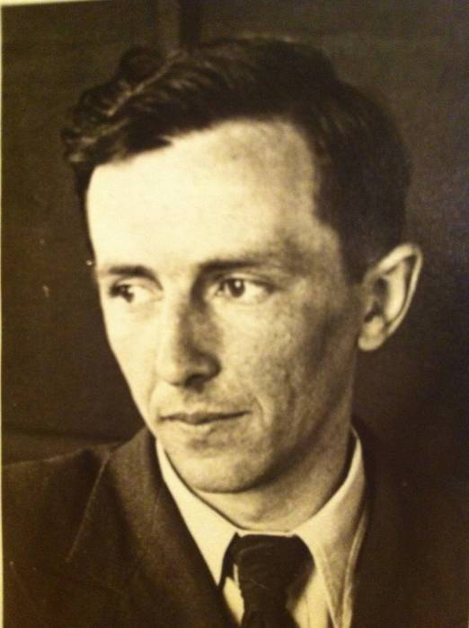

**November 23, 1920 - August 1, 2017**

{:.rounded.image--xl}

## Service

### Readings

  * [Wherever You Go](dedushka/dedushka_norbet.pdf) (Gregory Norbet)
  * [Dedushka: A Remembrance](dedushka/dedushka_remembrance.pdf) (Sasha Thaler)
  * [Benediction](dedushka/dedushka_benediction.pdf)

### Music

  * Welcome: [Priidite Poklonimsya](https://www.youtube.com/watch?v=N7miybFC9EI) (Sergei Rachmaninov)
  * Interlude: [There is A Balm in Gilead](https://www.youtube.com/watch?v=okl2XbTM7xM) (Paul Robeson)
  * Recessional: [Posledniy Trolleybus](https://www.youtube.com/watch?v=fUYkK2Inra8) (Bulat Okudzhava)
  
## Obituary

SUFFIELD, Connecticut --- Boris Yakovlevich Miroshnichenko, of Suffield, originally of Voronezh, and then St. Petersburg (Leningrad), Russia, passed away on August 1, 2017.  

Boris studied at the Voronezh Aviation Engineering University. At the start of World War II, he was evacuated to Tashkent, Uzbekistan to continue his studies, and at the same time to work in a military aircraft manufacturing plant. He earned his master’s degree in aviation engineering in 1945. After the war, he began teaching at the Leningrad (now Saint Petersburg) State Institute of Technology, and simultaneously earned his Ph.D. in design engineering in 1959. He remained at the Institute for the next 47 years, for over 20 of them as the Head of the Department of Design Engineering, until his retirement in 1992. Over the course of his distinguished career, he taught architectural geometry and other engineering courses, served in various administrative roles, and pioneered the use of personal computers for teaching design engineering in his department.

Boris was a lifelong learner and brought a physics-based approach to every aspect of his life. At the age of 45, he taught himself speed skating. Later in life, after learning about Chinese acupuncture, he pored over hand-transcribed manuscripts to learn the technique, then built his own electro-acupuncture apparatuses from found and recycled components. 

After retiring and moving to the U.S. in 1993, Boris took up drawing and painting. Applying the same enthusiasm and determination to learning this new skill as he had to his other endeavors, he spent hours reading books, watching instructional programs, and practicing, starting with pencil and charcoal drawings, then moving on to pastels and eventually oils. He filled his home with landscapes and portraits, some drawn from life and others taken from his imagination. In keeping with his life’s philosophy of resourcefulness, most were framed with found or repurposed materials.

Boris was predeceased by his wife Liudmila. He is survived by his daughter, Anna B. McCarthy of Suffield; and his granddaughter, Alexandra ("Sasha") Thaler, her husband Jesse, and their son, Adrian, of Cambridge, MA. 

His family would like to extend heartfelt thanks to the staff of The Suffield House for their loving and compassionate care. 

All are welcome to attend a memorial service at 1 p.m. on Monday, August 14, 2017 at Nicholson & Carmon Funeral Home, 443 East St. N., Suffield, CT 06078, followed by a burial at the Woodlawn Cemetery on Bridge St. in Suffield, and a gathering at the Gay Manse at 142 North Main Street in Suffield.  The family will receive friends on Monday from 12:30 p.m. - 1:00 p.m. prior to the service at the funeral home. Boris’s family kindly asks that no flowers be purchased for the family, and that any memorial contributions be made to the New England Air Museum, through their website: [http://www.neam.org/support-ways-to-give.php](www.neam.org/support-ways-to-give.php). 
