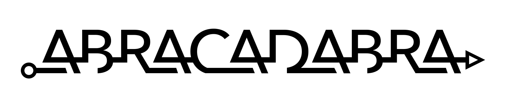

## IAIFI

{:.image--sm}  [IAIFI Logo](design/jthaler_IAIFI_Logo.pdf)

{:.image--sm}  [IAIFI Banner](design/jthaler_IAIFI_Banner.jpg), based on artwork by [agsandrew](https://agsandrew.myportfolio.com/) - stock.adobe.com

[NSF Institute for Artificial Intelligence and Fundamental Interactions](http://www.iaifi.org/), *August 2020*

## OmniFold

{:.image--sm} [OmniFold Logo](design/jthaler_OmniFold_Logo.pdf)

[OmniFold](https://github.com/ericmetodiev/OmniFold/), *MIT, November 2019*

    
## BOOST 2019

 {:.image--sm}  [BOOST 2019 Poster](design/jthaler_BOOST2019_Poster.pdf), [with bleeds](design/jthaler_BOOST2019_Poster_Bleed.pdf)

[BOOST 2019 Workshop](https://indico.cern.ch/e/boost2019), *MIT, July 2019*

    
## ABRACADABRA

{:.image--sm} [ABRACADABRA Logo](design/jthaler_ABRALogo_Large.pdf)

{:.image--sm} [ABRA Logo](design/jthaler_ABRALogo_Medium.pdf)

{:.image--sm }[A. Logo](design/jthaler_ABRALogo_Small.pdf)

[ABRACADABRA Experiment](http://abracadabra.mit.edu/), *MIT, August 2017*

## CMS/MIT Open Data

{:.image--sm}     [MOD Logo](design/jthaler_MOD_Logo.pdf)

{:.image--sm} [MOD Event Display](design/jthaler_MOD_EventDisplay.pdf)

MIT Open Data, *MIT, July 2015*

Featured in ["Guest Case Study 6:  Particle Collisions"](http://www.jthaler.net/cv/jthaler_frankel_picturing_science.pdf), Contribution to [Felice Frankel](https://www.felicefrankel.com/), [Picturing Science and Engineering](https://mitpress.mit.edu/books/picturing-science-and-engineering), *MIT Press, 2018*

## DarkLight

{:.image--sm} [DarkLight Logo](design/jthaler_DarkLight_Logo.pdf)

[DarkLight Experiment](http://dmtpc.mit.edu/DarkLight/) *MIT, September 2010*

