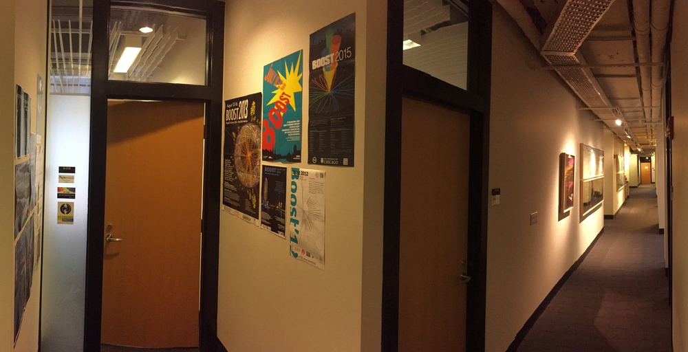

Each year, I typically have a few openings in my group for new researchers.  Depending on your career stage, there are different ways to join my group.

[Research Inquiry Form](https://forms.gle/dtDwGH8588dCHEfV8){:.button.button--outline-primary.button--pill.button--sm}

## Postdocs

With its huge breadth of research opportunities across theoretical particle physics, nuclear physics, and quantum information, the **[Center for Theoretical Physics (CTP)](http://ctp.mit.edu/)** at MIT is a great place to do postdoctoral research.  For researchers working at the intersection of physics and AI, there are also opportunities to engage with the **[Institute for Artificial Intelligence and Fundamental Interactions (IAIFI)]([http://iaifi.org/)**.

  * Applications for **CTP Postdocs** are typical due **mid-November**:  [CTP Postdocs](http://academicjobsonline.org/ajo/MIT/CTP/){:.button.button--outline-primary.button--pill.button--sm}
  * Nominations for the **Pappalardo Fellowship** are typical due in **early September**: [Pappalardo Fellowship](https://physics.mit.edu/research/pappalardo-fellowships-in-physics/){:.button.button--outline-primary.button--pill.button--sm}
  * Applications for the **IAIFI Fellowship** are typical due in **mid-October**:  [IAIFI Fellowship](https://iaifi.org/fellows.html){:.button.button--outline-primary.button--pill.button--sm}
  * If you have **External Funding**, please fill out this form to indicate your interest:  [Research Inquiry Form](https://forms.gle/dtDwGH8588dCHEfV8){:.button.button--outline-primary.button--pill.button--sm}

## Ph.D. Students

I anticipate at least one opening for a Ph.D. student in my research group in the coming years.  I am particularly interested in supervising students in the **[MIT Interdisciplinary Doctoral Program in Statistics (IDPS)](https://stat.mit.edu/academics/idps/idps-physics/)**, though I am open to working on all aspects of physics in and beyond the standard model. 

### Current MIT Students

  * **Current MIT Ph.D. students** should fill out this form to indicate your interest:  [Research Inquiry Form](https://forms.gle/dtDwGH8588dCHEfV8){:.button.button--outline-primary.button--pill.button--sm}
  
### Visiting Students

  * Visiting PhD students must have full financial support to visit MIT; self-funded visits are not possible.
  * If you have external funding, you can fill out this form to indicate your interest:  [Research Inquiry Form](https://forms.gle/dtDwGH8588dCHEfV8){:.button.button--outline-primary.button--pill.button--sm}

### Propspective MIT Students

  * Applications for **prospective MIT Ph.D. students** are due in **mid-December**: [MIT Physics Ph.D. Program](https://physics.mit.edu/academic-programs/graduate-students/graduate-admissions/){:.button.button--outline-primary.button--pill.button--sm}
  * MIT does not have a separate Master's program in Physics, so you should apply to the Ph.D. program.
  * Out of fairness to other applicants, I do not meet with prospective students in advance of their application.  You can alert me to your application by filling out this form, but I will typically not respond:  [Research Inquiry Form](https://forms.gle/dtDwGH8588dCHEfV8){:.button.button--outline-primary.button--pill.button--sm}
  * If you are admitted, I would be delighted to talk to you about research opportunities in my group at the **[Physics Graduate Open House](https://physics.mit.edu/openhouse/)** event typically held in early April.
  

## Undergraduates

To do meaningful research in theoretical particle physics at the undergraduate level, you must have taken at least a course on Relativity (8.033) and a full year of Quantum Mechanics (8.05/8.06).  I often work with students who have been exposed to some graduate-level courses at MIT, though there are also research projects available for students with extensive programming experience.

### Current MIT Students

  * **Current MIT B.S. students** should fill out this form to indicate your interest:  [Research Inquiry Form](https://forms.gle/dtDwGH8588dCHEfV8){:.button.button--outline-primary.button--pill.button--sm}
  * Most of my undergraduates get funding through: [Undergraduate Research Opportunities Program](http://web.mit.edu/UROP/){:.button.button--outline-primary.button--pill.button--sm}
  * I sometimes work with MIT Master's students through:  [EECS MEng Program](https://www.eecs.mit.edu/academics/undergraduate-programs/meng-program/){:.button.button--outline-primary.button--pill.button--sm}

### Visiting Students

  * The primary way that I work with summer interns is through: [MIT Summer Research Program](https://oge.mit.edu/graddiversity/msrp/){:.button.button--outline-primary.button--pill.button--sm}
  * Visiting undergraduate students must have full financial support to visit MIT; self-funded visits are not possible.
  * If you external funding, you can fill out this form to indicate your interest:  [Research Inquiry Form](https://forms.gle/dtDwGH8588dCHEfV8){:.button.button--outline-primary.button--pill.button--sm}

## High Schoolers

  * Currently, I am not conducting research with high school students.
  * Here is a list of recommended summer programs: [Summer Programs from MIT Admissions](https://mitadmissions.org/apply/prepare/summer/){:.button.button--outline-primary.button--pill.button--sm}
