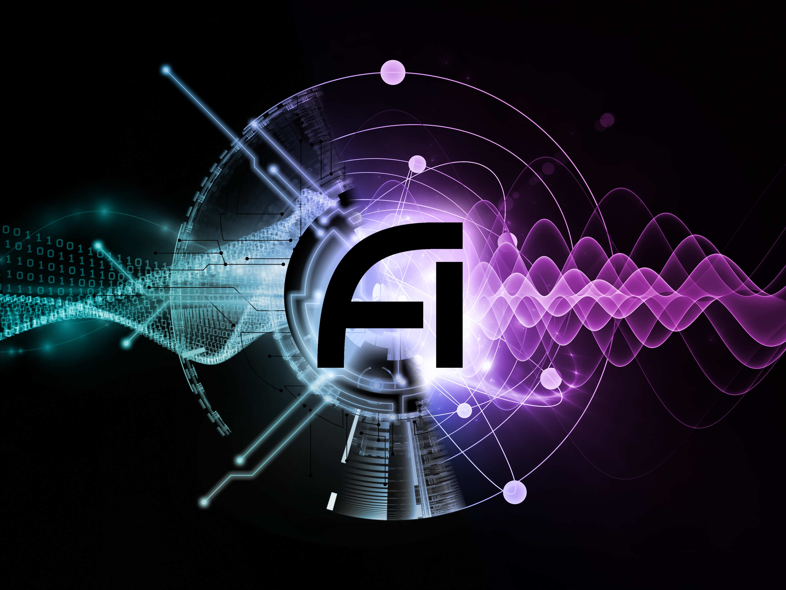

## Memorials

  * [Aaron](aaron.html)
  * [Dedushka](dedushka.html)
  * [Ania](ania.html)

## Graphic Design

### IAIFI

{:.image--sm}  **[IAIFI Logo](design/jthaler_IAIFI_Logo.pdf)**

{:.image--sm}  **[IAIFI Banner](design/jthaler_IAIFI_Banner.jpg)**, based on artwork by [agsandrew](https://agsandrew.myportfolio.com/) - stock.adobe.com

[NSF Institute for Artificial Intelligence and Fundamental Interactions](http://www.iaifi.org/), *August 2020*

### OmniFold

{:.image--sm} **[OmniFold Logo](design/jthaler_OmniFold_Logo.pdf)**

[OmniFold](https://github.com/ericmetodiev/OmniFold/), *MIT, November 2019*

    
### BOOST 2019

 {:.image--sm}  **[BOOST 2019 Poster](design/jthaler_BOOST2019_Poster.pdf)**, [with bleeds](design/jthaler_BOOST2019_Poster_Bleed.pdf)

[BOOST 2019 Workshop](https://indico.cern.ch/e/boost2019), *MIT, July 2019*

    
### ABRACADABRA

{:.image--sm} **[ABRACADABRA Logo](design/jthaler_ABRALogo_Large.pdf)**

{:.image--sm} **[ABRA Logo](design/jthaler_ABRALogo_Medium.pdf)**

{:.image--sm } **[A. Logo](design/jthaler_ABRALogo_Small.pdf)**

[ABRACADABRA Experiment](http://abracadabra.mit.edu/), *MIT, August 2017*

### CMS/MIT Open Data

{:.image--sm}     **[MOD Logo](design/jthaler_MOD_Logo.pdf)**

{:.image--sm} **[MOD Event Display](design/jthaler_MOD_EventDisplay.pdf)**

MIT Open Data, *MIT, July 2015*

Featured in ["Guest Case Study 6:  Particle Collisions"](http://www.jthaler.net/cv/jthaler_frankel_picturing_science.pdf), Contribution to [Felice Frankel](https://www.felicefrankel.com/), [Picturing Science and Engineering](https://mitpress.mit.edu/books/picturing-science-and-engineering), *MIT Press, 2018*

### DarkLight

{:.image--sm} **[DarkLight Logo](design/jthaler_DarkLight_Logo.pdf)**

[DarkLight Experiment](http://dmtpc.mit.edu/DarkLight/) *MIT, September 2010*

## Extended Biography

Though I was born in [Minneapolis, Minnesota](https://www.minneapolismn.gov/), I spent my formative years in [York, Maine](http://www.yorkmaine.org/).  My brother, [Aaron](aaron), and I used to play all sorts of fun games including "wig" which nearly resulted in vital organ loss.  I survived through [York Middle School](http://www.yorkschools.org/yms/) despite soldered glasses, a bad hair cut, and one-on-one math tutorials in a janitor's closet.  My success was partly due to a love affair with a tenor saxophone.

I went to high school at [Phillips Exeter Academy](http://www.exeter.edu/).  It was there that I developed my radio personality, Lester Johnson, on [90.5 FM WPEA](https://www.exeter.edu/community/student-organizations/wpea).  I also learned how to rock out on the electric bass through a spiritual encounter with the band/fruit juice known as [Nedlog](http://www.nedlog.com/).   Oh, and I happened to meet a [fine looking Russian-Cuban](https://www.armstrongteasdale.com/alexandra-thaler/) in a class on Zen Buddhism.

In 2002, I received an Sc.B. in Math/Physics from [Brown University](http://www.brown.edu/).  At Brown, I was heavily involved with an upright bass named Else, until I was sucked into an eight-piece 70s funk band named DLicks.  Lester spent a few too many hours doing late-night freeform radio at [95.5 WBRU](http://www.wbru.com).  It was fun while it lasted... my/his sanity, that is.

Now I am engaged in an equally brain warping activity:  theoretical physics.  I received my Ph.D. in [high energy theory](http://hetg.physics.harvard.edu) at [Harvard University](http://www.harvard.edu/), working with [Nima Arkani-Hamed](https://www.ias.edu/people/faculty-and-emeriti/arkani-hamed) to elucidate some of the deep mysteries of the universe.  

I then spent a glorious three-and-a-half years in California, doing post-doctorial research as a [Miller Fellow](http://millerinstitute.berkeley.edu/) at [UC Berkeley](http://www.berkeley.edu/) and [LBNL](http://www.lbl.gov).  Sasha and I [tied the knot](http://wedding.jthaler.net/) in 2007, and we've been enjoying married life ever since, testing the [laws](http://en.wikipedia.org/wiki/Half_Dome) [of](http://en.wikipedia.org/wiki/Mount_Tallac) [gravity](http://en.wikipedia.org/wiki/La_Plata_Peak) at every opportunity.  

Alas, our time on the left coast was short-lived, and Sasha and I moved (back) to New England in 2010.  I am now living the (academic) dream as a [Professor](http://web.mit.edu/physics/people/faculty/thaler_jesse.html) in the [Center for Theoretical Physics](http://www-ctp.mit.edu/) at [MIT](http://www.mit.edu/).  In my research, I attempt to address some of the outstanding questions in fundamental physics, including the nature of dark matter, the apparent weakness of gravity, and the symmetry structure of our universe.

In 2020, I become Director of the [Institute for Artificial Intelligence Fundamental Interactions](http://iaifi.org).  I used to make jokes about how "deep learning" could never compete with "deep thinking", but I guess now the joke's on me.

## Archives

  * [Sasha and Jesse's Wedding](http://wedding.jthaler.net)
  * [jthaler.net (v1)](http://v1.jthaler.net/)
  * [jthaler.net (v2)](http://v2.jthaler.net/)
