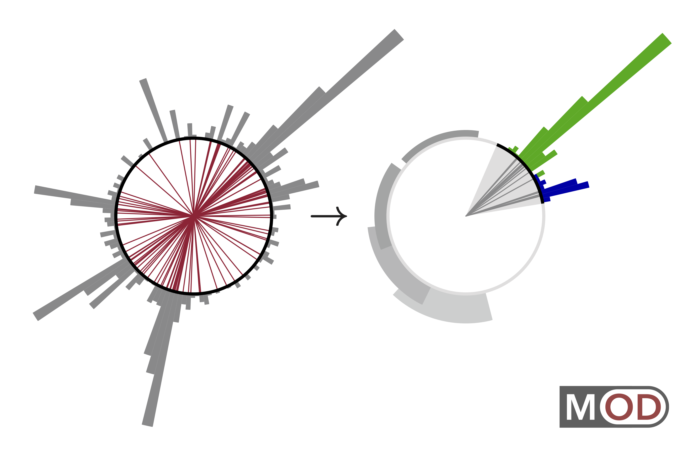
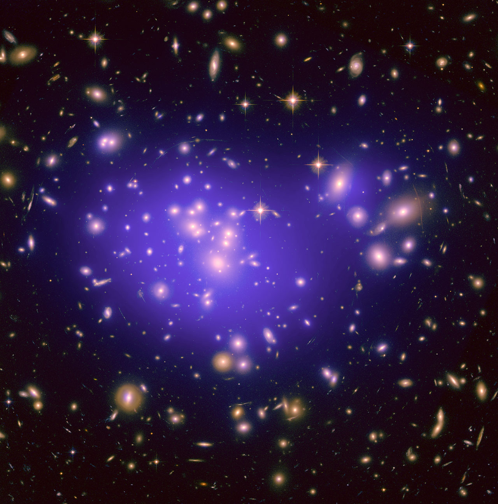
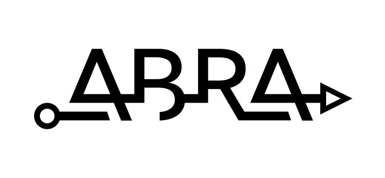



{{topimage.description}}

[Engagement CV](cv#public-engagement){:.button.button--outline-primary.button--pill.button--sm}

## Data Science and AI/ML

### Artificial Intelligence

  * **["Designing an AI Physicist"](https://cerncourier.com/a/designing-an-ai-physicist/)**, Opinion Viewpoint, *[CERN Courier, September-October 2021](https://cerncourier.com/wp-content/uploads/2021/08/CERNCourier2021SepOct-digitaledition.pdf#CCSepOct21-digital.indd%3A.17586%3A1070)*
  * **["Collision Course: Artificial Intelligence meets Fundamental Physics"](http://www.jthaler.net/talks/jthaler_2020_10_TommyFlowers_Keynote.pdf)**, Keynote Presentation, ["Tommy Flowers Network Conference"](http://tommyflowersnetwork.blogspot.com/2020/07/virtual-conference-lets-get-physical.html), *Virtual, October 2020*

### Open Data

  * **["Slow and Steady"](https://rdcu.be/bMHQn)**, coauthored with Matthew Strassler, Correspondence, [Nature Physics 15:725 (2019)](https://doi.org/10.1038/s41567-019-0628-z).
  * **["The Future of Particle Physics is 'Open'"](https://cylindricalonion.web.cern.ch/blogs/future-particle-physics-open)**, Guest Blog Post, The Cylindrical Onion, *CMS Experiment, December 2017*

## Collider Physics and QCD

### Jet Substructure

  * **["Guest Case Study 6:  Particle Collisions"](http://www.jthaler.net/cv/jthaler_frankel_picturing_science.pdf)**, Contribution to [Felice Frankel](https://www.felicefrankel.com/), [Picturing Science and Engineering](https://mitpress.mit.edu/books/picturing-science-and-engineering), *MIT Press, 2018*

## Beyond the Standard Model

### Dark Matter

  * **["Listening for Dark Matter from the Basement of Building 24"](https://physics.mit.edu/wp-content/uploads/2020/05/physicsatmit_19_winslow-thaler.pdf)**, coauthored with Lindley Winslow, Contribution to [Physics@MIT Journal](https://web.mit.edu/physics/news/physicsatmit/fall2019.html), *Fall 2019*
  * **["Listening to the Invisible Universe"](http://www.jthaler.net/talks/jthaler_2019_04_FarCry.pdf)**, Program with [A Far Cry](https://afarcry.org/), [Open Rehearsal of Gravity](https://www.eventbrite.com/e/sold-out-a-far-cry-presents-sounds-of-the-universe-registration-58723801471#)**, *April 2019*
  * **["Confronting the Invisible Universe"](http://www.jthaler.net/talks/jthaler_2018_05_London_Dark_Matter.pdf)**, MIT Club of Great Britain Event, *London, May 2018*
  * **["Confronting the Invisible Universe"](https://www.youtube.com/watch?v=QNmSNY8VenQ)**, Public Talk, *Aspen Center for Physics, March 2017* 
    > Dark matter is an enigma. Even though it can be “seen” through its influence on gravity, dark matter is invisible to the other known forces of nature. There are numerous ongoing efforts to discover the origin and properties of dark matter, ranging from laboratory experiments to astrophysical investigations. This intense interest is driven in part by tantalizing hints that the nature of dark matter might be linked to other deep and unsolved mysteries in physics. In this talk, Prof. Thaler presents the overwhelming evidence for dark matter as well as speculates on the broader implications of the invisible universe.
  
### Higgs Boson
  
  * **["The Higgs Boson:  Triumph of the Standard Model"](http://vimeo.com/58392070)**, 24th Annual Kavli Frontiers of Science, *National Academy of Sciences, U.C. Irvine, November 2012*

## Graphic Design

[Design CV](cv#graphic-design){:.button.button--outline-primary.button--pill.button--sm}

### Logos

  

    

          <a href="design/jthaler_IAIFI_Logo.pdf">
            
           
              <b>IAIFI</b>
          </a>
    

    

          <a href="design/jthaler_OmniFold_Logo.pdf">
            
           
              <b>OmniFold</b>
          </a>
    

    

          <a href="design/jthaler_MOD_Logo.pdf">
            
           
              <b>MOD</b>
          </a>
    

    

          <a href="design/jthaler_DarkLight_Logo.pdf">
            
           
              <b>DarkLight</b>
          </a>
    

    

          <a href="design/jthaler_ABRALogo_Large.pdf">
            
           
              <b>ABRACADABRA</b>
          </a>
    

    

          <a href="design/jthaler_ABRALogo_Medium.pdf">
            
           
              <b>ABRA</b>
          </a>
    

    

          <a href="design/jthaler_ABRALogo_Small.pdf">
            
           
              <b>A.</b>
          </a>
    

  

### Images

  

    

          <a href="design/jthaler_IAIFI_Banner.jpg">
            
           
              <b>IAIFI Banner</b>
          </a>
    

    

          <a href="design/jthaler_MOD_EventDisplay.pdf">
            
           
              <b>MOD Event Display</b>
          </a>
    

    

          <a href="design/jthaler_BOOST2019_Poster.pdf">
            
           
              <b>BOOST 2019 Poster</b>
          </a>
    

  

