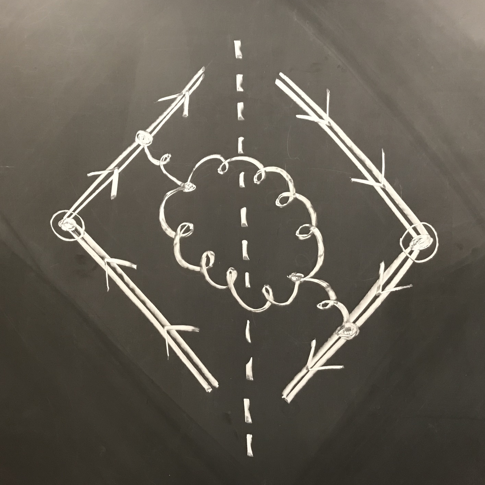

 

[Publications by Year](cv#publications--preprints){:.button.button--outline-primary.button--pill}
[Inspire](http://inspirehep.net/author/profile/Jesse.Thaler.1){:.button.button--outline-primary.button--pill}
[arXiv](http://arxiv.org/a/thaler_j_1){:.button.button--outline-primary.button--pill}
[ORCID](https://orcid.org/0000-0002-2406-8160){:.button.button--outline-primary.button--pill}
[Google Scholar](https://scholar.google.com/citations?user=djDP5SMAAAAJ){:.button.button--outline-primary.button--pill}


## {{topic.title}} {#{{topic.key}}}

### Selected Papers




  
  * **[{{paper.title}}](https://arxiv.org/abs/{{paper.arxiv}})** \\
        *{{paper.authors}}, [{{paper.short_journal | default: "DOI" }}](https://doi.org/{{paper.doi}})*
  




### Research Topics



<b>{{subtopic.title}}</b>



  * **[{{paper.title}}](https://arxiv.org/abs/{{paper.arxiv}})** `recommended`{:.success} \\
    *{{paper.authors}}, [{{paper.short_journal | default: "DOI" }}](https://doi.org/{{paper.doi}})*






